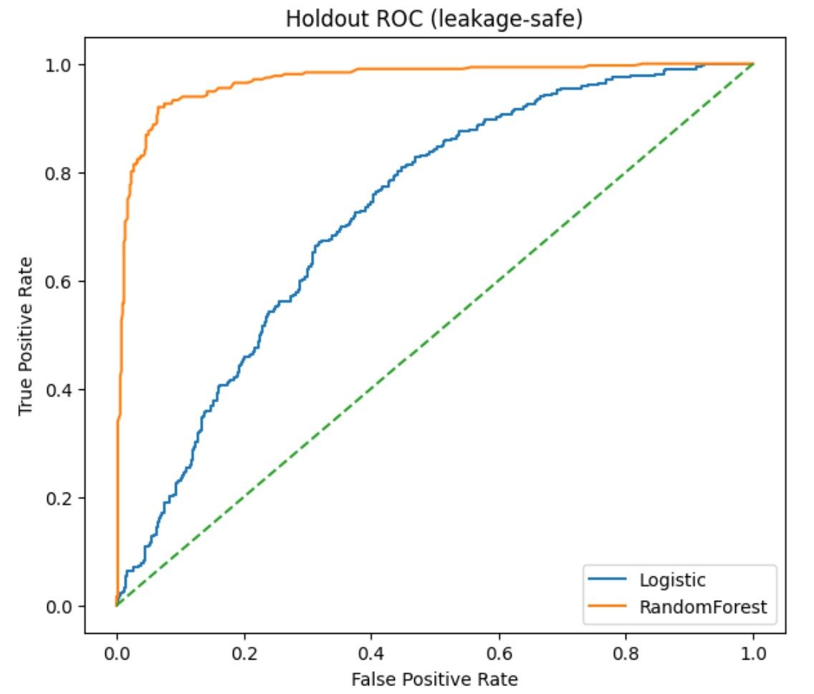
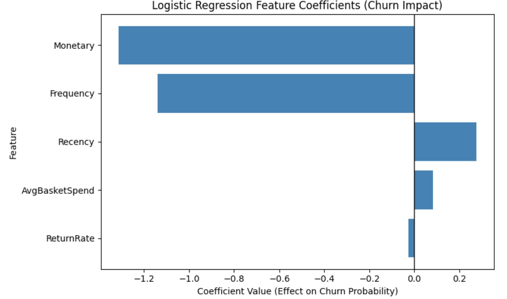
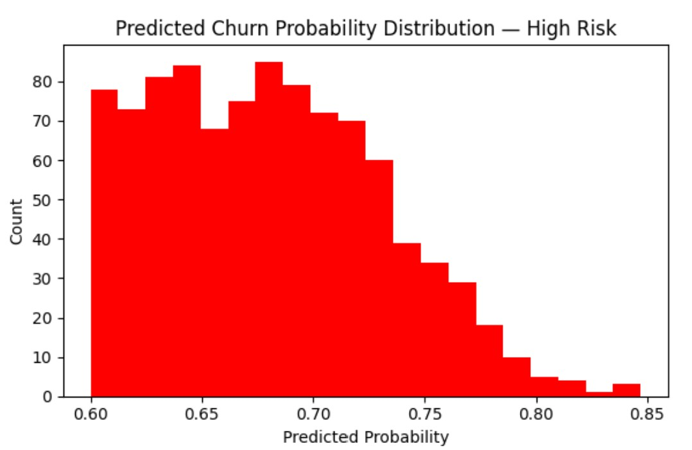
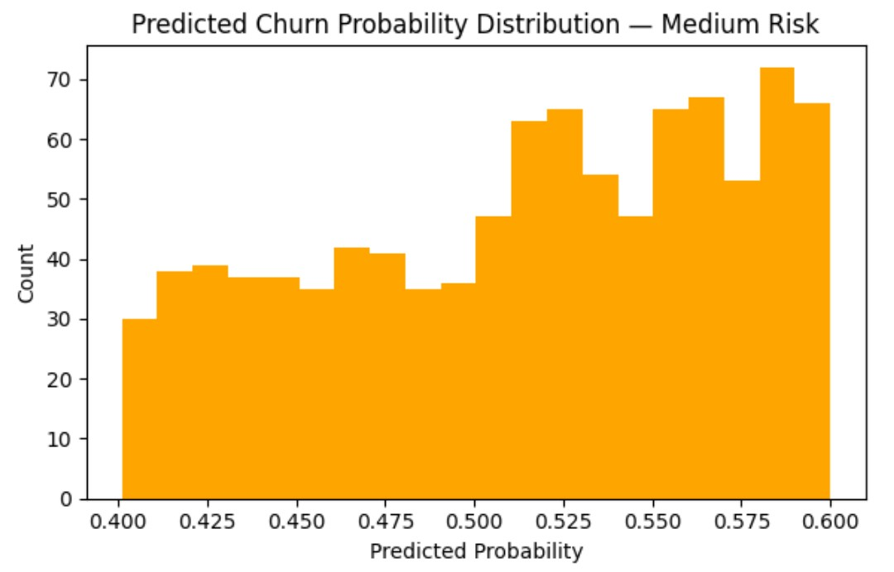
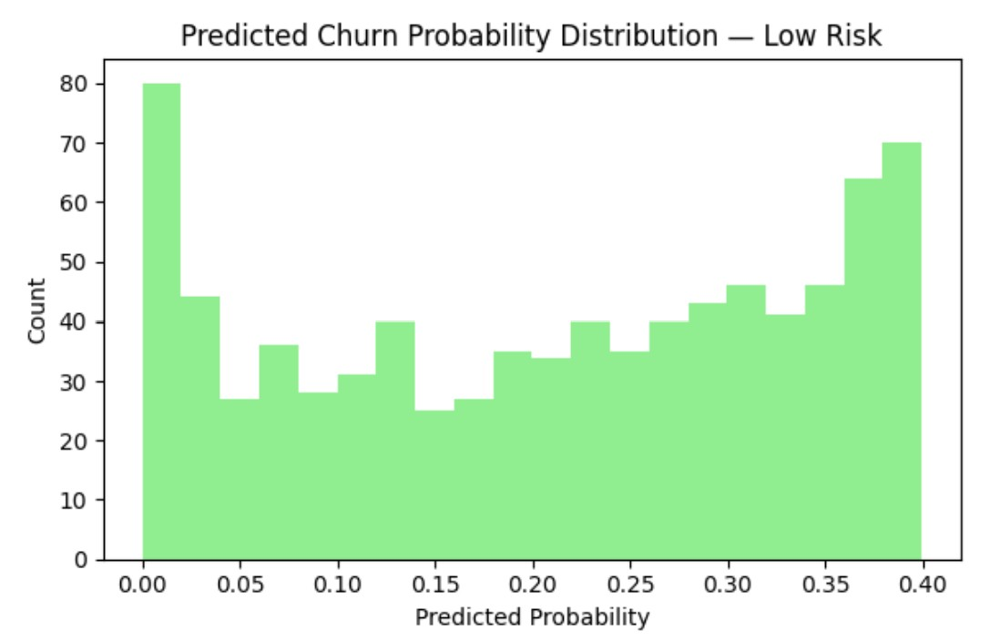

# E-commerce Churn Prevention System

This project builds an end-to-end e-commerce analytics and AI-driven decision support system. It converts raw transaction data into customer-level insights using feature engineering and churn modeling, evaluates retention strategies through expected value analysis, and enables natural-language access to insights via a Retrieval-Augmented Generation (RAG) interface. The system helps business teams identify at-risk customers, prioritize retention actions, and make data-backed decisions using both traditional analytics and generative AI.

## Basic Information
**Names:** N M Emran Hussain  
**Email:** nmemranhussain2023@gmail.com  
**Date:** October 2025  
**Model Version:** 1.0.0  
**License:** [Apache License Version 2.0,](LICENSE)

## Intended Use
**Purpose:** This project transforms raw e-commerce data into a decision-ready system by engineering customer behavior features, predicting churn risk, and evaluating retention strategies. It combines descriptive analytics, predictive modeling, and a Retrieval-Augmented Generation (RAG) layer, enabling users to query insights in natural language, all grounded in real customer data. The purpose of this RAG (Retrieval-Augmented Generation) system is to provide intelligent, context-grounded answers to user queries regarding E-commerce customer data and retention policies. It aims to assist users in understanding customer behavior (RFM), recommended retention actions, and overall policy summaries by leveraging a knowledge base built from various E-commerce datasets and the notebook's content.  
**Intended Users:** Marketing and CRM teams, Product and Growth Managers, Data Analysts and Data Scientists, and Business leaders and decision-makers.  
**Out-of-scope Uses:** Operational users, Real-time transaction processing systems, End consumers / shoppers, Users expecting real-time personalization at scale, and Teams seeking compliance, fraud detection, or financial auditing solutions.  

### Business Problem & Solution
**Business Problem:** Reducing Chunging rate, Improving ROI  
**Business Solution:** Understading Dataset, Modeling & RAG, Optimization (Customer Segmentation & EV), ROI Improvement, Future opportunity.

## Understanding Dataset
**Dataset Name & Source:** [Online Retail Dataset](https://archive.ics.uci.edu/dataset/352/online+retail)  
**Number of Samples:** The original dataset contains 541,909 rows. After the cleaning process—which includes removing duplicates and missing values—the notebook works with a processed set of 401,604 transactions.  
**Original Features Used:** InvoiceNo, StockCode, Description, Quantity, InvoiceDate, UnitPrice, CustomerID, and Country.  
**Engineered Features:** Year, Month, Day, Hour, DayOfWeek, IsWeekend, TotalAmount, Is_Return / Is_Cancelled, BasketUniqueItems, CustProductDiversity, CustTotalSales, Recency, Frequency, and Monetary  
**Target Feature:** Churn_Label  
**Unique Entries:** 4289 unique customers.  

### Data Dictionary

|Column Name	      |Modeling Role	|Measurement Level	|Description|
|------------------|--------------|------------------|-----------|
|InvoiceNo	|Metadata	|Nominal	|A unique 6-digit identifier for each transaction; used to calculate purchase frequency.|
|StockCode	|Metadata	|Nominal	|A unique product identifier used to track specific items and product diversity.|
|Description	|Metadata	|Nominal	|A text description of the product; primarily used for data inspection and RAG context.|
|Quantity	|Input	|Ratio	|The number of items purchased in a transaction; used to calculate total sales and monetary value.|
|InvoiceDate	|Metadata	|Interval	|The timestamp of the transaction, used to derive all time-based engineered features.|
|UnitPrice	|Input	|Ratio	|The price per unit of the product; crucial for calculating total transaction value.|
|CustomerID	|ID	|Nominal	|A unique identifier for each customer; used as the primary key for aggregating behavioral data.|
|Country	|Input	|Nominal	|The geographic location of the customer; used to analyze market distribution and regional churn patterns.|
|Year	|Metadata/Input	|Ordinal	|The year extracted from the InvoiceDate to identify long-term trends.|
|Month	|Input	|Ordinal	|The month of the transaction; used to capture seasonal shopping behaviors.|
|Day	|Input	|Ordinal	|The day of the month when the purchase occurred.|
|Hour	|Input	|Ordinal	|The hour of the day, used to identify peak shopping times (e.g., morning vs. evening).|
|DayOfWeek	|Input	|Ordinal	|The specific day (Monday-Sunday) used to analyze weekly purchase cycles.|
|IsWeekend	|Input	|Binary	|A flag (1/0) indicating if the purchase happened on a Saturday or Sunday.|
|TotalAmount	|Input	|Ratio	|The calculated total value of a transaction (Quantity × UnitPrice).|
|Is_Return / Is_Cancelled	|Input	|Binary	|Flags identifying if a transaction was a return or a cancellation; used to compute return rates.|
|BasketUniqueItems	|Input	|Ratio	|The number of distinct products (unique StockCodes) contained within a single invoice.|
|CustProductDiversity	|Input	|Ratio	|The cumulative number of different products a customer has bought over time.|
|CustTotalSales	|Input	|Ratio	|The total lifetime monetary value of all successful purchases made by the customer.|
|Recency	|Input	|Ratio	|The number of days since the customer’s last purchase; a core feature for churn modeling.|
|Frequency	|Input	|Ratio	|The total count of unique purchase transactions (orders) made by the customer.|
|Monetary	|Input	|Ratio	|The total expenditure of the customer; used alongside Recency and Frequency to profile value.|
|Churn_Label	|Target	|Binary	|The predicted variable; 1 indicates the customer has churned (inactive for >30 days), and 0 indicates they are active.|

### Training & Test Data

**Training Data Percentage:** 70% of the customer-level dataset (the RFM data) was used as training data.  
**Testing Data Percentage:** The remaining 30% was reserved as a holdout test set to evaluate model performance.

### **RAG Data Types Processed:** 
The knowledge base for this RAG system is constructed from the following primary data files and content:
- **`rfm.xls`:** Contains Recency, Frequency, and Monetary (RFM) metrics for customers.
- **`contextual_policy_recommendations.xls`:** Provides specific retention action recommendations and estimated rewards for individual customers.
- **`contextual_policy_summary.xls`:** Offers a summary of retention policies, including average ROI and customer volume per action.
- **`contextual_policy_tier_action_mix.xls`:** Details the mix of actions per policy tier (not directly used for document generation but part of initial load).
- **`Online_retail_cleaned.xls`:** The cleaned online retail transactional data (not directly used for document generation but assumed context for analysis).
- **`E-commerce_1_1.ipynb`:** The entire content of the Jupyter/Colab notebook, which includes code, markdown explanations, and outputs, providing context on the system's development and rationale.
- **`merged_customer_profiles.csv`:** A derived dataset combining RFM metrics with contextual policy recommendations for each customer.

## Modeling Details

### Model Type
- **Churn Classifier:** Logistic Regression and Random Forest.
- **Recommendation Engine:** Contextual Bandit (LinUCB) for personalized retention actions.
- **Conversational Layer:** Retrieval-Augmented Generation (RAG) using Gemini-2.5-flash and Gemini-embedding-001.
  
### Chunrning Model Training Methodology

This training data was used to fit a **Logistic Regression** model (with feature scaling) and a **Random Forest** classifier. Both models utilized balanced class weights to further account for the imbalance in the training labels.

### Evaluation Metrics  
- **Churn Prediction:** AUC, Precision, Recall, and F1-score (calculated using stratified test sets).
- **Retention Policy:** Projected ROI and Average Reward per action.
- **RAG System:** Groundedness and factual accuracy based strictly on provided context.

### Model Performance:

| Model       | AUC   | Precision | Recall |F1-score|
|-------------|-------|-----------|--------|--------|
| Logistic Regression | 0.723  | 0.529 | 0.763 | 0.625 |
| Random Forest| 0.704 | 0.559 | 0.442 | 0.494 |

- **Higher Discriminative Power:** Logistic Regression achieved an AUC of $0.723$, outperforming the Random Forest ($0.704$). This indicates a better overall ability to distinguish between customers who will churn and those who will stay.
- **Superior Recall for Churn Identification:** A critical finding is the Recall of $0.763$ for Logistic Regression compared to only $0.442$ for Random Forest. In a churn context, a higher recall is vital as it means the model successfully identifies 76.3% of actual churners, allowing the marketing team to intervene before they leave.
- **Balanced F1-Score:** The F1-score of 0.625 for Logistic Regression (vs. 0.494 for Random Forest) demonstrates a much healthier balance between Precision and Recall. While Random Forest has slightly higher Precision (0.559), it suffers from a high "false negative" rate, missing more than half of the at-risk customers.
- **Model Selection Strategy:** Logistic Regression was selected as the production model not only for its superior predictive metrics (AUC and Recall) but also for its coefficient transparency. This allows the business to see exactly which features (like "Recency" or "Return Rate") are the strongest drivers of churn risk.

### Feature Importance
**Monetary value** and **Frequency** are the strongest predictors of lower churn probability (negative coefficients). **Recency** is the strongest predictor of higher churn probability (positive coefficient). The Logisitic Regression Coefficients are given below:  

|Feature|Coefficient|Importance|
|-------|-----------|----------|
|Monetary|	-1.31	|1.31|
|Frequency|	-1.14	|1.14|
|Recency|	0.27	|0.27|
|AvgBasketSpend	|0.08	|0.08|
|ReturnRate	|-0.03|	0.03|

### Model & Rag System Architecture (With Version)
- **Feature Engineering:** Conversion of raw transactional data into aggregated customer profiles including diversity of products purchased and weekend shopping flags.- 
- **Vector Database:** ChromaDB (Version 0.6.3)for persistent storage and retrieval of semantic embeddings.
- **Text Splitting Technology:** LangChain (Version 0.3.5)
- **RAG Workflow:** Embedding Model: models/gemini-embedding-001.
- **Generative Model:** models/gemini-2.5-flash.
- **Knowledge Base Construction:** Structured customer profiles (RFM + Predicted Policy) converted to natural language strings. Technical documentation and code snippets extracted directly from the processing notebook.
- **Vector Indexing:** Recursive character splitting into 1,000-character chunks with 200-character overlap for context preservation.
- **Retrieval Mechanism:** Persistent ChromaDB store using cosine similarity of embeddings.
- **Functionality & Usage of RAG Chatbot:** The RAG Chatbot operates as an interactive analytics system that processes natural language queries by first converting them into vector embeddings via the gemini-embedding-001 model. These embeddings allow the system to perform a semantic search within a **ChromaDB vector store**, retrieving the most relevant context chunks from the e-commerce knowledge base. By dynamically merging this retrieved context with expert system instructions and the user’s original question, the chatbot constructs an augmented prompt for the **gemini-2.5-flash model** to generate a concise, fact-grounded response. This workflow is managed through a continuous conversational loop initiated by the **start_chatbot_session()** function, which maintains the interactive session until the user explicitly exits.

### Version of the Modeling Software: 
- **pandas:** '3.1.2',
- **Numpy:** 1.26.4
- **Scikit-learn:** '1.5.2',
- **Seaborn:** '0.13.2',
- **Matplotlib:** 3.10.0,
- **Streamlit:**	1.52.1

## Optimization & Quantitative Analysis
### Customer Segmentation
Customers are segmented into three risk tiers based on predicted churn probability (Churn_Prob):
- **High Risk:** Churn_Prob ≥ 0.60
- **Medium Risk:** 0.40 ≤ Churn_Prob < 0.60
- **Low Risk:** Churn_Prob < 0.40

### Summary of Tiers (from churn_risk_tier_dashboard.csv):

|Risk_Tier	|Customers	|Avg_Prob	|Actual_ChurnRate	|Recency	|Frequency	|Monetary	|AvgBasketSpend	|ReturnRate	|Portfolio_%|
|-----------|-----------|---------|-----------------|---------|-----------|---------|---------------|-----------|-----------|
|High	|968	|0.681	|0.582	|113.780	|13.504	|227.532	|26.634	|0.049	|35.0|
|Medium	|969	|0.514	|0.369	|47.953	|32.301	|523.030	|20.461	|0.023	|35.0|
|Low	|832	|0.211	|0.141	|27.035	|133.429	|2316.738	|21.072	|0.025	|30.0|

## ROI Improvement

### Optimal Action Mix by Total EV (from risk_action.csv):

- **Highest ROI Action:** 'call+coupon' (Average Reward: $6.23).
- **Lowest ROI Action:** 'email' (Average Reward: $0.03).

|Action	|Customers	|Total_Cost	|Total_IncGM	|Total_EV	|Avg_EV|
|-------|-----------|-----------|-------------|---------|-------|
|sms+coupon	|941	|1740.85	|6371.54	|4630.69	|4.92|
|sms	|1690	|84.50	|4111.93	|4027.43	|2.38|
|call+coupon	|27	|102.60	|270.88	|168.28	|6.23|
|email	|70	|0.70	|3.14	|2.44	|0.03|

- **Optimal Strategy per Tier (Policy Reward Matrix - Average EV by Tier and Action):**

|Action \ Tier	|High Risk	|Medium Risk	|Low Risk|
|---------------|-----------|-------------|--------|
|call+coupon	|4.96	|3.55	|0.71|
|sms+coupon	|4.96	|3.55	|0.71|
|sms	|4.96	|3.55	|0.71|
|email	|0.03	|0.03	|0.03|

- **sms+coupon** and **sms** are the primary drivers of **positive EV**, targeting the largest number of customers.**call+coupon** yields the highest Avg_EV per customer (£6.23) but is applied to a **small, high-value segment**. Targeting **High and Medium risk tiers is most profitable**.
- **High-Risk customers** are **best targeted with sms+coupon (highest EV)**. **Medium-Risk customers** respond best to **sms**. **Low-Risk customers** should primarily receive **sms** or **email** (minimal cost, small positive EV).
  
### Plots
 

**Description**: ROC curve for the Logistic Regression & Random Forest model on the holdout set to visually represent its discriminative power and performance in distinguishing between churning and active customers.

 

**Description**: This horizontal bar chart is displaying the absolute coefficient values for each feature from the Logistic Regression model, sorted in descending order of importance. 

 

**Description**: This visual validates how well the model's assigned High Risk tiers correspond to actual churn behavior, using appropriate colors and labels.

 

**Description**: This visual validates how well the model's assigned Medium Risk tiers correspond to actual churn behavior, using appropriate colors and labels.
 
 

**Description**: This visual validates how well the model's assigned Low Risk tiers correspond to actual churn behavior, using appropriate colors and labels.

 

**Description**: This visual illustrates the relationship between how recently a customer purchased and their predicted churn probability across different risk segments, using a color palette to distinguish tiers and adding clear axis labels.

 

**Description**: This visualization is clearly highlight the most financially beneficial retention actions for each customer segment based on the ROI analysis, with annotations for EV values.

## Limitation, Biases & Future Work

### Limitations and Biases
- **Data Timeliness:** Based on data from 2010-2011; customer behavior patterns may have evolved.
- **Churn Definition:** A 90-day inactivity window might not be universally applicable.
- **Generalizability:** Model trained on a single dataset; performance might vary with different customer bases or industries.
- **Feature Completeness:** Only RFM and derived features are used; external factors (e.g., marketing spend, competitor actions, customer service interactions) are not included.
- **Model Simplification:** Logistic Regression is a linear model and may not capture highly complex non-linear relationships, though it performs well here.
- **Cost/Uplift Estimates:** The ROI simulation relies on estimated costs, redemption rates, and uplift values, which should be validated with real-world A/B testing.
- **Strict Context Adherence**: The chatbot is designed to answer questions strictly based on the provided CONTEXT. It will not use external knowledge or make assumptions beyond what is explicitly present in the indexed documents. This ensures factual consistency but may limit its ability to answer very broad or unrepresented questions.
- **Absence of External Knowledge**: The system does not access real-time data or information outside of its pre-indexed knowledge base. Therefore, its responses are limited to the information captured at the time of knowledge base creation.
- **Impact of Chunking Strategy**: The effectiveness of retrieval is influenced by the `RecursiveCharacterTextSplitter`'s `chunk_size` (1000 characters) and `chunk_overlap` (200 characters). While designed to maintain comprehensive context, very long or complex information spanning across multiple non-overlapping chunks might be less optimally retrieved. Queries requiring synthesis of information across widely separated chunks could be challenging.
- **Data Freshness**: The accuracy of answers related to RFM metrics or policy recommendations depends on the freshness of the `rfm.xls` and `contextual_policy_recommendations.xls` datasets. If underlying customer data changes, the model card will need to be updated.

### Future Work
- **Model Retraining:** Regularly retrain the model with fresh data to capture evolving customer behavior.
- **Feature Expansion:** Incorporate more granular data (e.g., product categories, website activity, customer support interactions) for richer context.
- **Dynamic Churn Definition:** Explore adaptive churn definitions based on product lifecycle or customer segments.
- **A/B Testing:** Conduct controlled experiments to validate the estimated costs and effectiveness of retention actions.
- **Advanced Modeling:** Investigate more complex models (e.g., XGBoost, neural networks) if performance gains justify the increased complexity and interpretability challenges.
- **LinUCB Tuning:** Tune the alpha parameter and refine reward engineering for the contextual bandit to achieve a more balanced and cost-effective marketing mix.
- **Improvement of 'hallucinations':** The current RAG system design effectively prevents **hallucinations** by strictly confining the chatbot's knowledge to its indexed data, making it a reliable tool for grounded information retrieval within its defined scope.
- **Robut Chunking Strategy:** Future enhancements could explore adaptive chunking strategies or semantic chunking to improve context retrieval for more complex queries and expand the knowledge base with real-time or more diverse E-commerce-specific content to increase its utility.

