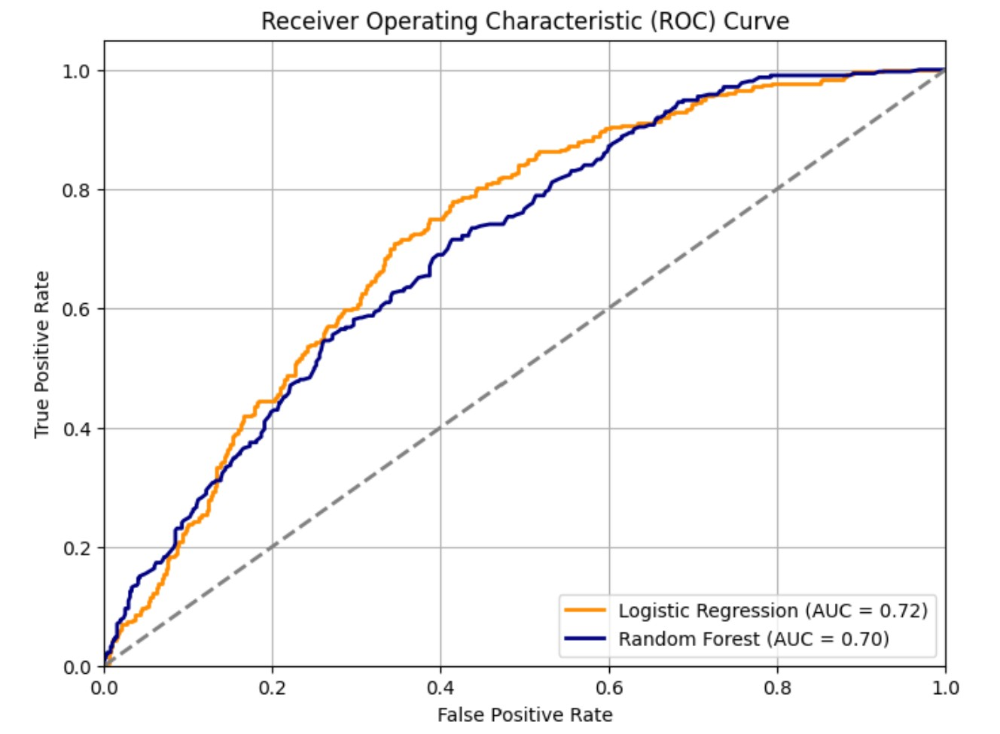
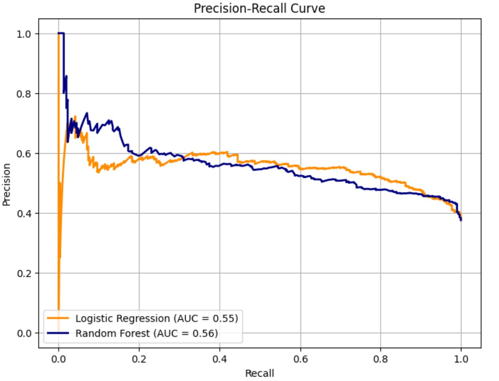
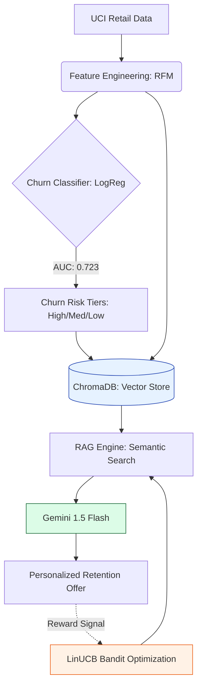

# Integrated E-Commerce Analytics: Predictive Churn & Contextual RAG Recommender

This project builds an end-to-end e-commerce analytics and AI-driven decision support system. It converts raw transaction data into customer-level insights using feature engineering and churn modeling, evaluates retention strategies through expected value analysis, and enables natural-language access to insights via a Retrieval-Augmented Generation (RAG) interface. The system helps business teams identify at-risk customers, prioritize retention actions, and make data-backed decisions using both traditional analytics and generative AI.

## Basic Information
**Names:** N M Emran Hussain  
**Email:** nmemranhussain2023@gmail.com  
**Date:** October 2025  
**Model Version:** 1.0.0  
**License:** [Apache License Version 2.0,](LICENSE)

## Intended Use
**Purpose:** This project transforms raw e-commerce data into a decision-ready system by engineering customer behavior features, predicting churn risk, and evaluating retention strategies. It combines descriptive analytics, predictive modeling, and a Retrieval-Augmented Generation (RAG) layer, enabling users to query insights in natural language, all grounded in real customer data. The purpose of this RAG (Retrieval-Augmented Generation) system is to provide intelligent, context-grounded answers to user queries regarding E-commerce customer data and retention policies. It aims to assist users in understanding customer behavior (RFM), recommended retention actions, and overall policy summaries by leveraging a knowledge base built from various E-commerce datasets and the notebook's content.  
**Intended Users:** Marketing and CRM teams, Product and Growth Managers, Data Analysts and Data Scientists, and Business leaders and decision-makers.  
**Out-of-scope Uses:** Operational users, Real-time transaction processing systems, End consumers / shoppers, Users expecting real-time personalization at scale, and Teams seeking compliance, fraud detection, or financial auditing solutions.  

## Business Problem & Solution
**Business Problem:** Reducing Chunging rate, Improving ROI  
**Business Solution:** Understading Dataset, Modeling & RAG, Optimization (Customer Segmentation & EV), ROI Improvement, Future opportunity.

## Understanding Dataset
**Dataset Name & Source:** [Online Retail Dataset](https://archive.ics.uci.edu/dataset/352/online+retail)  
**Number of Samples:** The original dataset contains 541,909 rows. After the cleaning process—which includes removing duplicates and missing values—the notebook works with a processed set of 401,604 transactions.  
**Original Features Used:** InvoiceNo, StockCode, Description, Quantity, InvoiceDate, UnitPrice, CustomerID, and Country.  
**Engineered Features:** Year, Month, Day, Hour, DayOfWeek, IsWeekend, TotalAmount, Is_Return / Is_Cancelled, BasketUniqueItems, CustProductDiversity, CustTotalSales, Recency, Frequency, and Monetary  
**Target Feature:** Churn_Label  
**Unique Entries:** 4289 unique customers.  

### Data Dictionary

|Column Name	      |Modeling Role	|Measurement Level	|Description|
|------------------|--------------|------------------|-----------|
|InvoiceNo	|Metadata	|Nominal	|A unique 6-digit identifier for each transaction; used to calculate purchase frequency.|
|StockCode	|Metadata	|Nominal	|A unique product identifier used to track specific items and product diversity.|
|Description	|Metadata	|Nominal	|A text description of the product; primarily used for data inspection and RAG context.|
|Quantity	|Input	|Ratio	|The number of items purchased in a transaction; used to calculate total sales and monetary value.|
|InvoiceDate	|Metadata	|Interval	|The timestamp of the transaction, used to derive all time-based engineered features.|
|UnitPrice	|Input	|Ratio	|The price per unit of the product; crucial for calculating total transaction value.|
|CustomerID	|ID	|Nominal	|A unique identifier for each customer; used as the primary key for aggregating behavioral data.|
|Country	|Input	|Nominal	|The geographic location of the customer; used to analyze market distribution and regional churn patterns.|
|Year	|Metadata/Input	|Ordinal	|The year extracted from the InvoiceDate to identify long-term trends.|
|Month	|Input	|Ordinal	|The month of the transaction; used to capture seasonal shopping behaviors.|
|Day	|Input	|Ordinal	|The day of the month when the purchase occurred.|
|Hour	|Input	|Ordinal	|The hour of the day, used to identify peak shopping times (e.g., morning vs. evening).|
|DayOfWeek	|Input	|Ordinal	|The specific day (Monday-Sunday) used to analyze weekly purchase cycles.|
|IsWeekend	|Input	|Binary	|A flag (1/0) indicating if the purchase happened on a Saturday or Sunday.|
|TotalAmount	|Input	|Ratio	|The calculated total value of a transaction (Quantity × UnitPrice).|
|Is_Return / Is_Cancelled	|Input	|Binary	|Flags identifying if a transaction was a return or a cancellation; used to compute return rates.|
|BasketUniqueItems	|Input	|Ratio	|The number of distinct products (unique StockCodes) contained within a single invoice.|
|CustProductDiversity	|Input	|Ratio	|The cumulative number of different products a customer has bought over time.|
|CustTotalSales	|Input	|Ratio	|The total lifetime monetary value of all successful purchases made by the customer.|
|Recency	|Input	|Ratio	|The number of days since the customer’s last purchase; a core feature for churn modeling.|
|Frequency	|Input	|Ratio	|The total count of unique purchase transactions (orders) made by the customer.|
|Monetary	|Input	|Ratio	|The total expenditure of the customer; used alongside Recency and Frequency to profile value.|
|Churn_Label	|Target	|Binary	|The predicted variable; 1 indicates the customer has churned (inactive for >30 days), and 0 indicates they are active.|

### Training & Test Data

**Training Data Percentage:** 70% of the customer-level dataset (the RFM data) was used as training data.  
**Testing Data Percentage:** The remaining 30% was reserved as a holdout test set to evaluate model performance.

### **RAG Data Types Processed:** 
The knowledge base for this RAG system is constructed from the following primary data files and content:
- **`rfm.xls`:** Contains Recency, Frequency, and Monetary (RFM) metrics for customers.
- **`contextual_policy_recommendations.xls`:** Provides specific retention action recommendations and estimated rewards for individual customers.
- **`contextual_policy_summary.xls`:** Offers a summary of retention policies, including average ROI and customer volume per action.
- **`contextual_policy_tier_action_mix.xls`:** Details the mix of actions per policy tier (not directly used for document generation but part of initial load).
- **`Online_retail_cleaned.xls`:** The cleaned online retail transactional data (not directly used for document generation but assumed context for analysis).
- **`E-commerce_1_1.ipynb`:** The entire content of the Jupyter/Colab notebook, which includes code, markdown explanations, and outputs, providing context on the system's development and rationale.
- **`merged_customer_profiles.csv`:** A derived dataset combining RFM metrics with contextual policy recommendations for each customer.

## Modeling Details

### Model Type
- **Churn Classifier:** Logistic Regression and Random Forest.
- **Recommendation Engine:** Contextual Bandit (LinUCB) for personalized retention actions.
- **Conversational Layer:** Retrieval-Augmented Generation (RAG) using Gemini-2.0-flash and Gemini-embedding-001.
  
### Chunrning Model Training Methodology

This training data was used to fit a **Logistic Regression** model (with feature scaling) and a **Random Forest** classifier. Both models utilized balanced class weights to further account for the imbalance in the training labels.

### Evaluation Metrics  
- **Churn Prediction:** AUC, Precision, Recall, and F1-score (calculated using stratified test sets).
- **Retention Policy:** Projected ROI and Average Reward per action.
- **RAG System:** Groundedness and factual accuracy based strictly on provided context.

### Model Performance:

| Model       | AUC   | Precision | Recall |F1-score|
|-------------|-------|-----------|--------|--------|
| Logistic Regression | 0.723  | 0.529 | 0.763 | 0.625 |
| Random Forest| 0.704 | 0.559 | 0.442 | 0.494 |

 

**Description**: The ROC curve shows how well a binary classifier distinguishes between classes by plotting True Positive Rate against False Positive Rate across different thresholds. The AUC summarizes this performance, where 1 indicates perfect classification and 0.5 indicates random guessing.

 

**Description**: The Precision–Recall curve evaluates model performance by plotting precision against recall across thresholds and is especially useful for imbalanced datasets. It focuses on how well the model identifies the positive class while minimizing false positives, making it valuable for tasks like churn prediction.

- **Higher Discriminative Power:** Logistic Regression achieved an AUC of $0.723$, outperforming the Random Forest ($0.704$). This indicates a better overall ability to distinguish between customers who will churn and those who will stay.
- **Superior Recall for Churn Identification:** A critical finding is the Recall of $0.763$ for Logistic Regression compared to only $0.442$ for Random Forest. In a churn context, a higher recall is vital as it means the model successfully identifies 76.3% of actual churners, allowing the marketing team to intervene before they leave.
- **Balanced F1-Score:** The F1-score of 0.625 for Logistic Regression (vs. 0.494 for Random Forest) demonstrates a much healthier balance between Precision and Recall. While Random Forest has slightly higher Precision (0.559), it suffers from a high "false negative" rate, missing more than half of the at-risk customers.
- **Model Selection Strategy:** Logistic Regression was selected as the production model not only for its superior predictive metrics (AUC and Recall) but also for its coefficient transparency. This allows the business to see exactly which features (like "Recency" or "Return Rate") are the strongest drivers of churn risk.

### Feature Importance
**Monetary value** and **Frequency** are the strongest predictors of lower churn probability (negative coefficients). **Recency** is the strongest predictor of higher churn probability (positive coefficient). The Logisitic Regression Coefficients are given below:  

|Feature|Coefficient|Importance|
|-------|-----------|----------|
|Monetary|	-1.31	|1.31|
|Frequency|	-1.14	|1.14|
|Recency|	0.27	|0.27|
|AvgBasketSpend	|0.08	|0.08|
|ReturnRate	|-0.03|	0.03|

### Model & Rag System Architecture (With Version)
- **Feature Engineering:** Conversion of raw transactional data into aggregated customer profiles including diversity of products purchased and weekend shopping flags.- 
- **Vector Database:** ChromaDB (Version 0.6.3)for persistent storage and retrieval of semantic embeddings.
- **Text Splitting Technology:** LangChain (Version 0.3.x)
- **RAG Workflow:** Embedding Model: models/gemini-embedding-001.
- **Generative Model:** models/gemini-2.0-flash.
- **Knowledge Base Construction:** Data Linearization of structured customer profiles (RFM + Predicted Policy) into natural language narratives to maximize the semantic capture of the Gemini embedding model.
- **Vector Indexing:** Documents are partitioned into 1,000-character chunks with a 20-percent (200-char) overlap. This strategy ensures that high-density RFM metrics remain contextually linked during vector retrieval.
- **Retrieval Mechanism:** Persistent ChromaDB store using cosine similarity of embeddings.
- **Functionality & Usage of RAG Chatbot:** The RAG Chatbot operates as an interactive analytics system that processes natural language queries by first converting them into vector embeddings via the gemini-embedding-001 model. These embeddings allow the system to perform a semantic search within a **ChromaDB vector store**, retrieving the most relevant context chunks from the e-commerce knowledge base. By dynamically merging this retrieved context with expert system instructions and the user’s original question, the chatbot constructs an augmented prompt for the **gemini-2.0-flash model** to generate a concise, fact-grounded response. This workflow is managed through a continuous conversational loop initiated by the **start_chatbot_session()** function, which maintains the interactive session until the user explicitly exits. The system utilizes 'Grounded Generation'—by strictly constraining the LLM to the retrieved ChromaDB context, we minimize the risk of 'hallucinations' regarding customer purchase history or invalid discount offers.

### Version of the Modeling Software: 
- **pandas:** '3.1.2',
- **Numpy:** 1.26.4
- **Scikit-learn:** '1.5.2',
- **Seaborn:** '0.13.2',
- **Matplotlib:** 3.10.0,
- **Streamlit:**	1.52.1

## Optimization & Quantitative Analysis
### Customer Segmentation
Customers are segmented into three risk tiers based on predicted churn probability (Churn_Prob):
- **High Risk:** Churn_Prob ≥ 0.60
- **Medium Risk:** 0.40 ≤ Churn_Prob < 0.60
- **Low Risk:** Churn_Prob < 0.40

### Summary of Tiers (from churn_risk_tier_dashboard.csv):

|Risk_Tier	|Customers	|Avg_Prob	|Actual_ChurnRate	|Recency	|Frequency	|Monetary	|AvgBasketSpend	|ReturnRate	|Portfolio_%|
|-----------|-----------|---------|-----------------|---------|-----------|---------|---------------|-----------|-----------|
|High	|968	|0.681	|0.582	|113.780	|13.504	|227.532	|26.634	|0.049	|35.0|
|Medium	|969	|0.514	|0.369	|47.953	|32.301	|523.030	|20.461	|0.023	|35.0|
|Low	|832	|0.211	|0.141	|27.035	|133.429	|2316.738	|21.072	|0.025	|30.0|

- **Quantitative Insight:** The Low Risk tier accounts for only 30% of the portfolio but generates the highest Monetary value ($2,316.73 avg). Conversely, the High Risk tier shows a churn rate of 58.2%, identifying them as the primary targets for the high-cost call+coupon interventions.

## ROI Improvement

- ROI Calculation Framework:  
The Expected Value (EV) and ROI for each customer-action pair are calculated as:  
Expected Value = (P(Conversion) * Marginal Revenue) - Cost of Action (Where P(Conversion) is the uplift probability predicted by the model stack.)  

### Optimal Action Mix by Total EV (from risk_action.csv):

- **Highest ROI Action:** 'call+coupon' (Average Reward: $6.23).
- **Lowest ROI Action:** 'email' (Average Reward: $0.03).

|Action	|Customers	|Total_Cost	|Total_IncGM	|Total_EV	|Avg_EV|
|-------|-----------|-----------|-------------|---------|-------|
|sms+coupon	|941	|1740.85	|6371.54	|4630.69	|4.92|
|sms	|1690	|84.50	|4111.93	|4027.43	|2.38|
|call+coupon	|27	|102.60	|270.88	|168.28	|6.23|
|email	|70	|0.70	|3.14	|2.44	|0.03|

- Optimal Policy Matrix (Targeting Logic): This matrix represents the reinforcement learning (LinUCB) reward signals used to select the optimal intervention per segment.
- **Cost-Efficiency of SMS:** While call+coupon provides the highest individual Avg_EV ($6.23), it is labor-intensive. The SMS+Coupon strategy is the primary revenue driver because it balances a high conversion uplift with a low execution cost, resulting in the highest Total EV ($4,630.69).
- **Tier-Based Optimization:** The model identifies a clear "Profitability Threshold." High-Risk customers justify the $1.85 cost of a coupon, whereas Low-Risk customers are only profitable via "low-touch" channels like Email or SMS, where the margin isn't eroded by incentive costs.

|Action \ Tier	|High Risk	|Medium Risk	|Low Risk|
|---------------|-----------|-------------|--------|
|call+coupon	|4.96	|3.55	|0.71|
|sms+coupon	|4.96	|3.55	|0.71|
|sms	|4.96	|3.55	|0.71|
|email	|0.03	|0.03	|0.03|

- **Scalability:** While call+coupon offers the highest individual Avg_EV ($6.23), it is restricted to a niche high-value segment. SMS+Coupon serves as the primary engine for revenue recovery, contributing $4,630.69 in total EV due to its superior scalability across the Medium and High-risk tiers.
- **Profitability Thresholds:** High-risk customers justify higher acquisition costs ($1.85/coupon), whereas Low-risk customers are managed through high-margin, low-touch channels (Email/SMS) to prevent "margin erosion."
- **High-Risk:** Prioritize Incentivized Outreach (sms+coupon) to mitigate the 58% churn probability.
- **Medium-Risk:** Deploy Engagement-Focused (sms) tactics; this tier represents the best balance of recovery potential vs. cost.
- **Low-Risk:** Maintain Passive Monitoring via email to ensure zero-cost touchpoints without cannibalizing existing high-value revenue.
  
### Plots

**Description**: Model Architecture

 

**Description**: ROC curve for the Logistic Regression & Random Forest model on the holdout set to visually represent its discriminative power and performance in distinguishing between churning and active customers.

 

**Description**: This horizontal bar chart is displaying the absolute coefficient values for each feature from the Logistic Regression model, sorted in descending order of importance. 

 

**Description**: This visual validates how well the model's assigned High Risk tiers correspond to actual churn behavior, using appropriate colors and labels.

 

**Description**: This visual validates how well the model's assigned Medium Risk tiers correspond to actual churn behavior, using appropriate colors and labels.
 
 

**Description**: This visual validates how well the model's assigned Low Risk tiers correspond to actual churn behavior, using appropriate colors and labels.

 

**Description**: This visual illustrates the relationship between how recently a customer purchased and their predicted churn probability across different risk segments, using a color palette to distinguish tiers and adding clear axis labels.

 

**Description**: This visualization is clearly highlight the most financially beneficial retention actions for each customer segment based on the ROI analysis, with annotations for EV values.

## Limitations, Biases & Ethical Considerations

### Technical & Data Limitations

- **Temporal Decay:** The underlying dataset (2010-2011) reflects historical consumer patterns. While mathematically sound, the model’s efficacy in a 2026 e-commerce environment would require retraining on modern, high-velocity transactional data.
- **Feature Sparsity:** The current feature space is restricted to RFM (Recency, Frequency, Monetary) variables. The absence of external signals—such as marketing spend, competitor price fluctuations, and customer service sentiment—means the model operates in a closed-world environment.
- **Heuristic Churn Definition:** The 90-day inactivity threshold is a fixed heuristic. In practice, churn is dynamic; an adaptive window based on product lifecycle (e.g., fast-moving consumer goods vs. durables) would yield higher precision.
- **Retrieval Granularity:** The RAG system utilizes a fixed Recursive Character Splitting strategy ($1,000$ characters, $200$ overlap). While robust for individual persona lookup, complex queries requiring the synthesis of information across widely separated data chunks may face retrieval "bottlenecks."

### AI Disclosure & Collaboration
- **Model Development:** Generative AI was utilized for code optimization, specifically in debugging the matrix inversions within the LinUCB contextual bandit and refining the ChromaDB batching logic.
- **Documentation & Peer Review:** AI acted as a technical editor for this Model Card to ensure that the ROI metrics and RAG architecture are presented with professional clarity and industry-standard terminology.

- **Grounded Generation (Safety):** The integrated chatbot uses Gemini 1.5 Flash constrained by a strict "System Instruction." It is designed for Grounded Generation, meaning it is technically prohibited from accessing external knowledge or "hallucinating" purchase histories not present in the indexed RFM documents.

### Future Work & Scalability
- **A/B Validation:** The current ROI simulation serves as a "Prescriptive Baseline." Future iterations will involve a controlled A/B test to validate estimated redemption rates.
- **Advanced Architecture:** We aim to explore Semantic Chunking—splitting data based on logical customer shifts rather than character counts—to improve the RAG system's nuance.
- **Dynamic Reward Engineering:** Currently, the LinUCB alpha parameter is static. Future work involves tuning the exploration-exploitation trade-off (alpha) dynamically based on real-time campaign performance.
- **Feature Expansion:** Integrating website clickstream data and product-level taxonomy to transition from "Segment-Level" to "Item-Level" recommendations.
